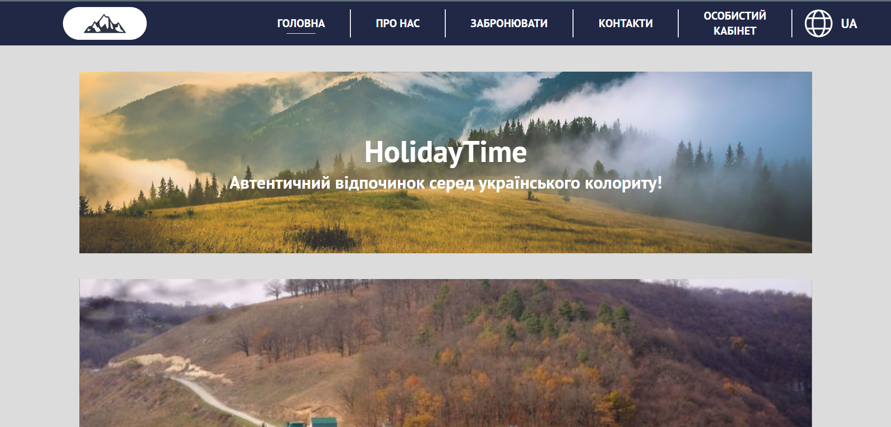
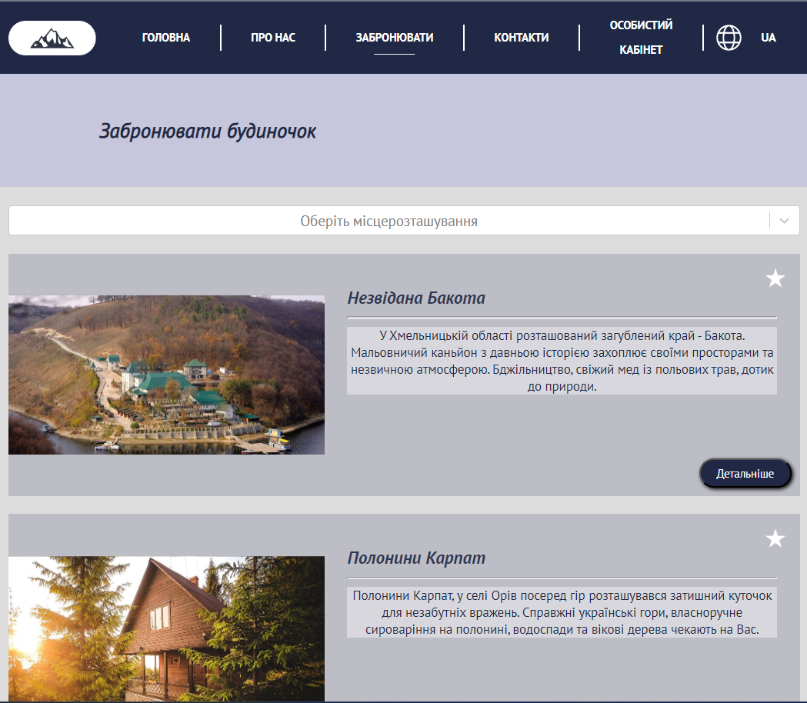
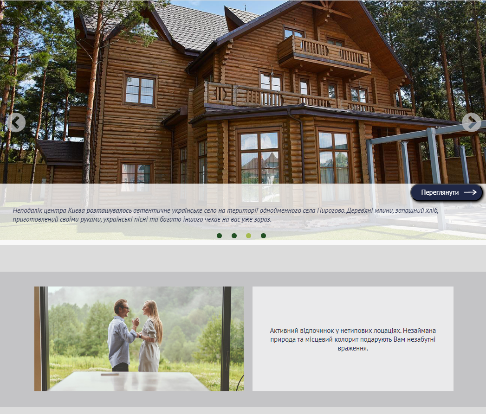
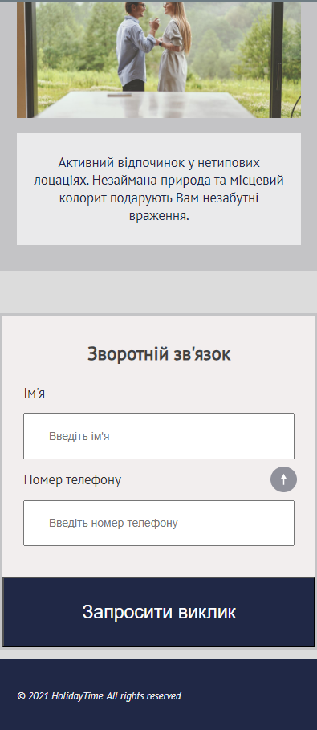
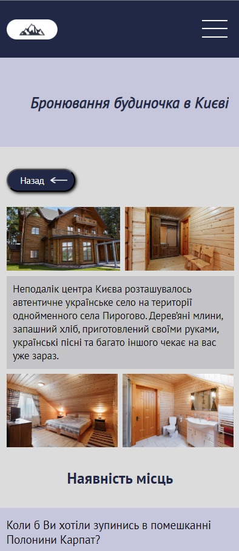

# HolidayTime
>This multi-page site was created from the University layout using program Figma.

## Functionality
>The site is intended for ordering and choosing a place to rest. It allows users to browse available locations, view their photos and other details, and make reservations.

### Tech stack
* [X] **React**: *JavaScript-library* for building user interfaces.
* [X] **Vite**: Fast and advanced web application development tool.
* [X] **React Router**: Library for navigating and managing pages in *React* applications.
* [X] **TypeScript**: We use TypeScript to generate typed JavaScript code, which allows us to make our code more secure and understandable.
* [X] **React Hook Form**: Is a react library that provides a simple and efficient way to manage forms in React. We use it to create and validate forms in our online store.
* [X] **react-slick**: react-slick is a library for creating beautiful and responsive carousels in React. We use react-slick to create dynamic and attractive sliders for our products and promotions.
* [X] **React-Select**: Library for creating stylish dropdown lists in React. It allows you to easily create various types of lists and provides flexible customization options.
* [X] **Redux**: Is a library for managing application state in React. We use Redux to store and manage global application state, such as the list of items in the cart and other important data.
* [X] **i18next**: Library for text localization in your application. It allows you to easily implement support for different languages and manage translations.
* [X] **SCSS**: Is a syntax that is an extension of Sass and provides compatibility with the standard CSS syntax. It allows you to use all the capabilities of Sass, as well as maintain syntactic compatibility with CSS.
* [X] **Figma**: is a web-based design and prototyping service that allows developers to create vector graphics, mockups, and user interfaces right in the web browser.
___

[This is a link to this site: *HolidayTime*](https://rss-777.github.io/HolidayTime/)

___
### Screenshot

    
    
    
    
    
    

